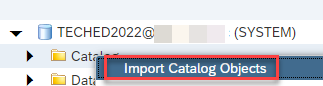
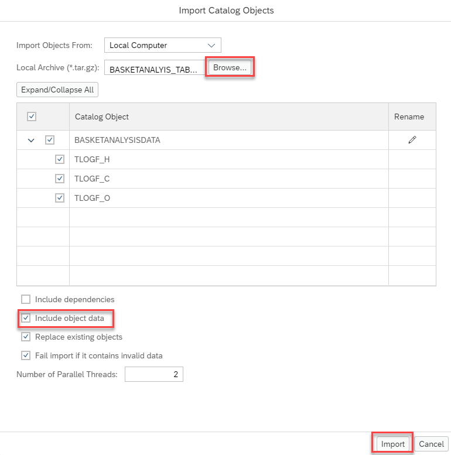

# Initial Setup 

## Prerequisites
A few housekeeping is needed for this workshop.

- a running SAP HANA Studio with a connection to a running SAP HANA Database
  - For users attending the TechEd 2022 Virtual Live Workshop, a connection info will be provided during the workshop
  - For users attending after the event, a local HANA Platform (express edition) is needed. Please follow the [installation instruction](https://developers.sap.com/group.hxe-install-vm-xsa.html)
  
- database user to connect is needed 
  - For users attending the TechEd 2022 Virtual Live Workshop, a user will be assigned to each participant
  - For users attending after the event, a system user can be used after the TechEd Live Workshop

## User Creation and Grant Privileges

There will be 2 users assigned to each participants for this workshop which will be assigned during the event
    - TECHEDUSERXX is the user that contains the tables and data 
    - TECHEDCONNXX is a technical user that will be used for connection from the SAP HANA Cloud to the on-prem SAP HANA Platform. 

>XX will be a number assigned during the live virtual workshop event. Please make sure that you are only using the assigned user so that it will not interfer with others

<details><summary><mark>If you are following this tutorial after the live event, please create 2 users in the tenant database connected with SYSTEM user</mark></summary>
<p>

  ```SQL
  CREATE USER TECHEDUSERXX PASSWORD Welcome1234 NO FORCE_FIRST_PASSWORD_CHANGE;
  CREATE USER TECHEDCONNXX PASSWORD Welcome1234 NO FORCE_FIRST_PASSWORD_CHANGE;
  GRANT MODELING, MONITORING TO TECHEDUSERXX;
  ```

</p>
</details>
</br>

Once the user have been assigned or created, login as the user TECHEDUSERXX and execute the following grants to allow the technical user access to the data 

  ```SQL
  GRANT SELECT ON SCHEMA TECHEDUSERXX TO TECHEDCONNXX;
  ```

## Setup base tables and data

For TechEd participants, the reference table and data will be provided in the BASKETANALYSISDATA schema as readonly. The tables needs to be created within each participants assigned schema.

  ```SQL
  CREATE TABLE "TLOGF_C" LIKE "BASKETANALYSISDATA"."TLOGF_C";
  CREATE TABLE "TLOGF_H" LIKE "BASKETANALYSISDATA"."TLOGF_H";
  CREATE TABLE "TLOGF_O" LIKE "BASKETANALYSISDATA"."TLOGF_O";

  INSERT INTO "TLOGF_C" SELECT * FROM "BASKETANALYSISDATA"."TLOGF_C";
  INSERT INTO "TLOGF_H" SELECT * FROM "BASKETANALYSISDATA"."TLOGF_H";
  INSERT INTO "TLOGF_O" SELECT * FROM "BASKETANALYSISDATA"."TLOGF_O";
  ```

<details><summary><mark>If you are following this tutorial after the live event, please import data into the BASKETANALYSISDATA schema prior to the steps above</mark></summary>
<p>

<details><summary>Import tables and data using SAP HANA Studio</summary>
<p>

- In the File menu, choose "Import":

  

- Select "Catalog Objects" and press "Next":

  

- Choose option "Import catalog objects from current client" and use the "Browse" button to navigate to the extracted folder that contains the folder "index". Select this folder.

  > Do not select the folder "index" itself but the folder containing it.

- select all three tables by clicking at them with the left mouse button

- choose "Add" to select them for import 

- press "Next"

- select the option to include data but keep the other options unselected:

  

- press "Finish"
The tables have now been imported with data.
</p>
</details>
</br>
<details><summary>Import tables and data using SAP HANA Database Explorer</summary>
<p>

- Open SAP HANA Database Explorer. The detail connection info will be given during TechEd Live Virtual Workshop

- As the database instance is not registered, you would need to register the connection info in the "Add Instance" dialog window

- Select "SAP HANA Database (Multitenant)" for the instance type

- Enter host info
- Use the TECHEDUSERXX user to connect

- Expand the connection and righ-click on "Catalog"

  - Choose "Import Catalog Objects":

    


- Use the "Browse" button to select your local version of [BASKETANALYIS_TABLES_DatabaseExplorer](exercises/resources/BASKETANALYIS_TABLES_DatabaseExplorer.tar.gz")

    - Select "Include object data". You can ignore the other options

    - Start the import process by pressing "Import":

    
The tables have now been imported with data.
</p>
</details>

</p>
</details>
</br>

## Summary

You have not prepared the base tables and data needed for modeling the calculation view and be replicated in real-time from on-premise to SAP HANA Cloud.

Continue to - [Exercise 2 - Excercise 2 ](/exercises/exercises/Exercise_2_SAP_HANA_STUDIO)