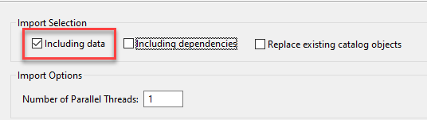

# Exercise 1 - Initial Setup

## Prerequisites
A few housekeeping is needed for this workshop.

- a running SAP HANA Studio with a connection to a running SAP HANA Database
  - For users attending the TechEd 2022 Virtual Live Workshop, a connection info will be provided during the workshop
  - For users attending after the event, a local HANA Platform (express edition) is needed. Please follow the [installation instruction](https://developers.sap.com/group.hxe-install-vm-xsa.html) to install a VM image locally.

- database user to connect is needed
  - For users attending the TechEd 2022 Virtual Live Workshop, a user will be assigned to each participant
  - For users attending after the event, database users need to be created

## User Creation and Grant Privileges

There will be 2 users assigned to each participants for this workshop which will be assigned during the event
    - TECHEDUSERXX is the user that contains the tables and data
    - TECHEDCONNXX is a technical user that will be used for connection from the SAP HANA Cloud to the on-prem SAP HANA Platform.

>XX will be a number assigned during the live virtual workshop event. Please make sure that you are only using the assigned user so that it will not interfer with others

<details><summary><mark>If you are following this tutorial after the live event, please create these 2 users in the tenant database connected with SYSTEM user</mark></summary>
<p>

  ```SQL
  CREATE USER TECHEDUSERXX PASSWORD Welcome1234 NO FORCE_FIRST_PASSWORD_CHANGE;
  CREATE USER TECHEDCONNXX PASSWORD Welcome1234 NO FORCE_FIRST_PASSWORD_CHANGE;
  GRANT MODELING, MONITORING TO TECHEDUSERXX;
  ```

</p>
</details>
</br>

Once the user have been assigned or created, login as the user TECHEDUSERXX and execute the following grants to allow the technical user access to the data

  ```SQL
  GRANT SELECT ON SCHEMA TECHEDUSERXX TO TECHEDCONNXX;
  ```

To later use tables in schema "TECHEDUSERXX" for modeling in SAP HANA Studio, execute the following grant statement:

  ```SQL
  GRANT SELECT ON SCHEMA TECHEDUSERXX TO _SYS_REPO WITH GRANT OPTION;
```

To later use tables in schema "TECHEDUSERXX" for modeling in SAP Web IDE, execute the following grant statements:
 ```SQL
  GRANT SELECT ON SCHEMA TECHEDUSERXX TO "_SYS_DI#SYS_XS_HANA_BROKER"."_SYS_DI_OO_DEFAULTS" WITH GRANT OPTION;
  GRANT SELECT ON SCHEMA TECHEDUSERXX TO "SYS_XS_HANA_BROKER"."RT_DEFAULTS";
  ```

With these two GRANT statements every SAP Web IDE project can create calculation views on top of tables in schema "TECHEDUSERXX".

  > Typically, not all projects should have the authorization to use certain tables and a more fine-granular authorization setup is used. How this can be achieved with HDI development can be found e.g., in this [blog](https://blogs.sap.com/2018/12/11/how-to-use-objects-contained-in-a-schema-outside-of-your-web-ide-full-stack-project-in-sap-hana-service/).


## Setup base tables and data

For TechEd participants, the reference table and data will be provided in the TECHEDUSERXX schema.


<details><summary><mark>If you are following this tutorial after the live event, please import data into the TECHEDUSERXX schema before starting the next exercise</mark></summary>
<p>

Import tables and data using SAP HANA Studio

- In the File menu, choose "Import":

  

- Select "Catalog Objects" and press "Next":

  

- Choose option "Import catalog objects from current client" and use the "Browse" button to navigate to the extracted folder that contains the folder "index". Select this folder.

  > Do not select the folder "index" itself but the folder containing it.

- select all three tables by clicking at them with the left mouse button

- choose "Add" to select them for import

- press "Next"

- select the option to include data but keep the other options unselected:

  

- press "Finish"
The tables have now been imported with data.


</p>
</details>
</br>

## Summary

You have now prepared the database users and base tables with data needed for modeling the calculation view and be replicated in real-time from on-premise to SAP HANA Cloud.

Continue to - [Exercise 2 - Calculation view modeling in SAP HANA Studio](/exercises/Exercise_2_SAP_HANA_STUDIO)
