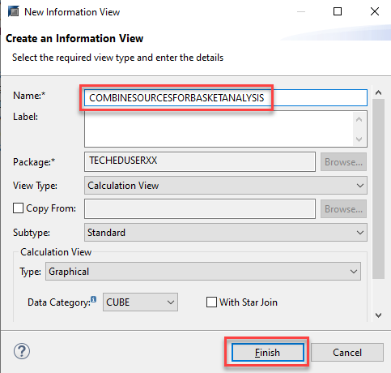
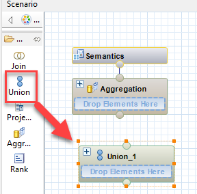
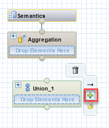
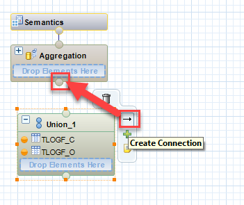
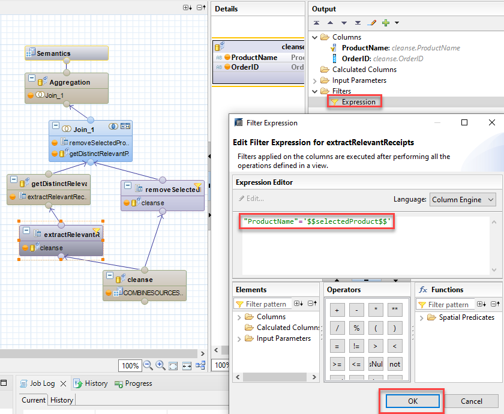

# Exercise 2 - Calculation view modeling in SAP HANA Studio

> If you don't have SAP HANA Studio already installed and configured then you can skip this section. Please skip to the next [exercise](/exercises/Exercise_3_SAP_WEBIDE/) 

In the following steps two calculation views are created from scratch that will later be replicated to SAP HANA Cloud.

 

## Create calculation view models

We will create two calculation view models. The first combines the two tables in a Union node. The second one joins the tables to enable a basket analysis of the data.

### Packages
Packages help structuring your development objects. We have already created a package for you with name "TECHEDUSERXX". You can find it under in your system connection under "Content":

<mark>If you are following this tutorial after the live event, please create this package first</mark>

#### Create package TECHEDUSERXX

- To create a package, right-click on "Content", select "New" and "Package"

  

  - Name it "TECHEDUSERXX" and choose "OK":

  

### Create calculation view COMBINESOURCESFORBASKETANALYSIS

This calculation view will combine different data source using a Union node.

- Right-click on your package "TECHEDUSERXX" and choose "New" and "Calculation View"
- Name the calculation view "COMBINESOURCESFORBASKETANALYSIS" and press "Finish":

  

  A graphical editor opens.

- Select the Union node icon and place it by a left-click on the modeling area:

  

- Use the Add Objects button:

  

- Search for tables with "TLOG" in their name, select "TLOGF_C" and "TLOGF_O" and press "OK":

  

- In the Details of the Union node that opens when double-clicking on the node, press icon "Auto Map By Name" to combine columns with same names in one output column

  

- Feed the output of the Union node into the Aggregation node by selecting the "Create Connection" icon and dragging the connection to the Aggregation node:

  

- To feed the columns of the "Aggregation" node to the node "Semantics":
    - double-click on node Aggregation to open the Details
    - click on the first column
    - hold the shift-key and click on the last column
    - finally right-click on any column and select "Add To Output". 
    
    All columns should now show an orange dot. If not, select the individual column and click on the grey dot to switch it to orange

    

#### Switch off Analytic Privilege check

- In node "Semantics" under "View Properties" select the empty option for "Apply Privileges":

  

  > If the analytic privilege check was not switched off an analytic privilege would be required to report on the calculation view. For details, see e.g., this [blog](https://blogs.sap.com/2022/09/23/sap-hana-cloud-analytic-privileges-a-step-by-step-guide/)

- Press "Save and Activate" to create the database object of the calculation view

  

The calculation view database object has now been generated and can be used.

 

### Design calculation View BASKETANALYIS_CALCULATE

This calculation view will prepare the data so they can be used for basked analyses.

#### Create Calculation View BASKETANALYSIS_CALCULATE

- Right-click on package "TECHEDUSERXX" and choose "New" and then "Calculation View"

- Name the view "BASKETANALYSIS_CALCULATE" and press "Finish"

  

#### Place nodes to modeling area

- Add 2 Projection Nodes, 2 Aggregation Nodes and 1 Join node to the modeling area. To do so click on the respective icon and then at an unoccupied space in the modeling area. Try to arrange the nodes roughly like in the screenshot below:

#### Rename nodes

- Rename the nodes as in the screenshot with the connected nodes below. To rename a node right-click on the name and choose "Rename": 

  

  In particular use the following names:
    - cleanse
    - extractRelevantReceipts
    - getDistinctRelevantProductIDs
    - removeSelectedProduct

#### Connect nodes

- connect the nodes with 6 lines as shown below. To start a connection click on "Create Connection" and drop the line on the target node like you did for  calculation view "COMBINESOURCESFORBASKETANALYSIS"

#### Add data source

- Add the calculation view COMBINESOURCESFORBASKETANALYSIS that was created in an earlier step as a data source to node "cleanse". To do so, choose "Add Objects" of node "cleanse", search for "COMBINESOURCESFORBASKETANALYSIS" and click "OK". 

#### Map columns to the output of the individual nodes

- In Details of node "cleanse", only feed columns "OrderID" and "ProductName" into the next node by clicking on their dot. To open the Details, double-click on node "cleanse":
 
  

- In Details of node "extractRelevantReceipts", select both columns in the same way to feed them into the next node:

  

- For node "getDistinctRelevantProductIDs" only select "OrderID":

  

- select both columns in node "removeSelectedProduct":

  

- In the Details of node "Join_1": drag a connection between both columns "OrderID". Select the line and choose JoinType "Inner" and Cardinality "n..m". Finally select "ProductName" comming from node "removeSelectedProduct" and "OrderID" comming from node "getDistinctRelevantProductIDs":

  

- In node "Aggregation", choose both columns:

  

#### Add an input parameter

- Double-click on node "Semantics", then on tab "Parameters/Variables" and click on the green plus-sign to choose "Create Input Parameter":

  

- Name the input parameter "selectedProduct" and choose "NVARCHAR" as Data Type, and length "300", confirm with "OK":

  

#### Add count distinct column

- Double-click on node "Aggregation", then on Output pane select "Calculated Columns" folder and right mouse clike to select "New Counter":

  

- name the counter "countFrequency" and add the column "OrderID". Finally confirm with "OK":

  

#### Switch off Analytic Privilege check

- In node "Semantics" under "View Properties" select the empty option for "Apply Privileges":

  

#### Add filters to the nodes

- Double-click on node "extractRelevantReceipts", then on "Expression" and enter:

  `"ProductName"='$$selectedProduct$$'`

  

- Confirm with "OK" 

This filter is used to remove all records that contain a different value in column "ProductName" than the value that is entered for the input parameter "selectedProduct" during query execution. 

- Double-click on node "removeSelectedProduct", then on "Expression" and enter:
  
  `"ProductName"!='$$selectedProduct$$'`

  

This filter will remove records with values in column "ProductName" that correspond to the value that is entered for the input parameter.

#### Save and activate calculation view

- press the "Save and Activate" icon:
  
  

The calculation view database object has now been generated and can be used.

## Summary
You have now created a calculation view model using the base tables imported using SAP HANA Studio.

Continue to - [Exercise 3 - Calculation view modeling in SAP Web IDE](/exercises/Exercise_3_SAP_WEBIDE)
