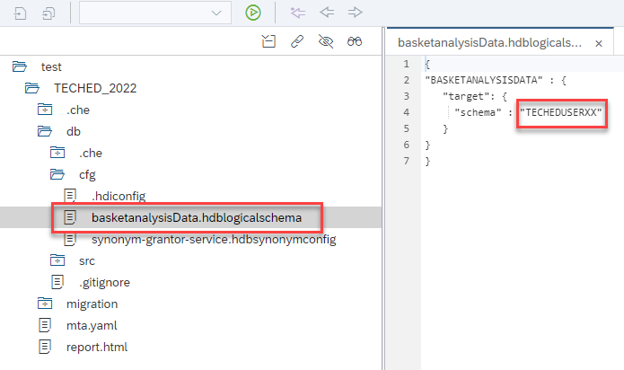

# Exercise 3 - Calculation view modeling in SAP Web IDE

## Prerequisites

- a running SAP Web IDE that is connected to the same SAP HANA database into which the tables had been imported
- a Web IDE user that is allowed to develop in a XSA space

Creating the same calculation views in SAP Web IDE would look very similar to creating them in SAP HANA Studio. Therefore, we migrated the views using the [xs-migration assistant](https://help.sap.com/docs/SAP_HANA_PLATFORM/58d81eb4c9bc4899ba972c9fe7a1a115/5775fac4200441589c12a5421d0bcb1e.html) and provide you the migrated calculation views in a [zip file](/exercises/resources/TECHED_2022.zip).

## Import migrated calculation views

- Click on "Workspace" so that it becomes highlighted

- In Menu "File", choose "Import", "File or Project"

    

- Use the Browse button to search for your local file "TECHED_2022.zip" (you can download it from the "resources" section), click on "Open" and confirm with "OK"

    

## Point synonyms to schema TECHEDUSERXX

The synonyms of the imported project are pointing to schema "BASKETANALYSISDATA". To redirect them to your schema:

- Navigate to file "basketAnalysisData.hdblogicalschema"
- Double-click on the file to open it
- Change the schema value from "BASKETANALYSISDATA" to "TECHEDUSERXX":

    

- save the changed file using the "Save" icon:

    


## Build the project

- Right-click on folder "db" and choose "Build", and "Build" again

    

- If you get an error message saying that no space is defined, press the "Configure Settings" button and select a space

- If no builder has been installed before, install the builder by pressing "Install Builder" (you won't see this button, if a Builder has already been installed)

    

    - Wait for the progess status for installing the builder to finish in the lower right corner:

        

    - you should see a success message for the builder:

        

- Press "Save", and right-click again on folder "db" to start the build process

The calculation views are deployed to your database.

## Grant Privileges to SELECT on the calculation views to database user TECHEDCONNXX

For the replication to SAP HANA Cloud user TECHEDCONNXX requires privilege SELECT on the respective calculation views. We will grant SELECT on the schema of the HDI container (for details see e.g., [grant select on HDI container schema](https://help.sap.com/docs/HANA_CLOUD_DATABASE/c2cc2e43458d4abda6788049c58143dc/14ccad20b2b64190b269a488e0f44cbc.html?locale=en-US)):

- Right-click on the db-folder and select "Open HDI Container":

    

- Right-click on the connection that was opened in Database Explorer and select "Open SQL Console (Admin)":

    

- Run the following statement in the opened SQL console:

    ```SQL
    SELECT CURRENT_USER, CURRENT_SCHEMA FROM DUMMY;
    ```
    - Type or copy and paste the statement into the opened SQL console
    - Mark the statement with the mouse and press the green arrow on the top left to run the marked statement:

        

        we refer to the resulting current_user with the term \<current_user\> and to the resulting current_schema with the term \<current_schema\> below

- Run additional SQL statements in the SQL console:

    - Copy and paste the following statements into the SQL console:
        ```SQL
        SET SCHEMA <current_user>;
        CREATE LOCAL TEMPORARY COLUMN TABLE #PRIVILEGES LIKE _SYS_DI.TT_SCHEMA_PRIVILEGES;
        INSERT INTO #PRIVILEGES ( PRIVILEGE_NAME, PRINCIPAL_SCHEMA_NAME, PRINCIPAL_NAME ) VALUES ( 'SELECT', '', '<TECHEDCONNXX>' );
        CALL <current_schema>.GRANT_CONTAINER_SCHEMA_PRIVILEGES( #PRIVILEGES, _SYS_DI.T_NO_PARAMETERS, ?, ?, ?);
        DROP TABLE #PRIVILEGES;
        ```

    - Replace \<current_user\> and \<current_schema\> with the values from the previous statement

    - Replace \<TECHEDCONNXX\> with your connection user name.

        The result should look similar to:

        ```SQL
        SET SCHEMA TECHED_2022_HDI_DB_1_727P5XNC3UZGJOFPRH7CDI8VV_DT;
        CREATE LOCAL TEMPORARY COLUMN TABLE #PRIVILEGES LIKE _SYS_DI.TT_SCHEMA_PRIVILEGES;
        INSERT INTO #PRIVILEGES ( PRIVILEGE_NAME, PRINCIPAL_SCHEMA_NAME, PRINCIPAL_NAME ) VALUES ( 'SELECT', '', 'TECHEDCONNXX' );
        CALL TECHED_2022_HDI_DB_1#DI.GRANT_CONTAINER_SCHEMA_PRIVILEGES( #PRIVILEGES, _SYS_DI.T_NO_PARAMETERS, ?, ?, ?);
        DROP TABLE #PRIVILEGES;
        ```
    - Mark the statements with the mouse and press the green arrow on the top left to run the marked statements

User TECHEDCONNXX has now SELECT privileges on the HDI container schema and therefore also on the calculation views that are deployed into it.

## Summary
You have now created the database objects of your calculation view models that had been migrated from the deprecated repository to HDI and assigned the neccessary authorizations to replicate the models to SAP HANA Cloud.

Continue to - [Exercise 4 - Setup calculation view replication from SAP HANA Platform to SAP HANA Cloud](/exercises/Exercise_4_Replicate_Calcview)
