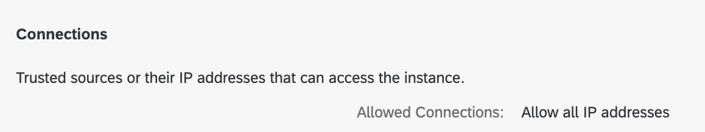
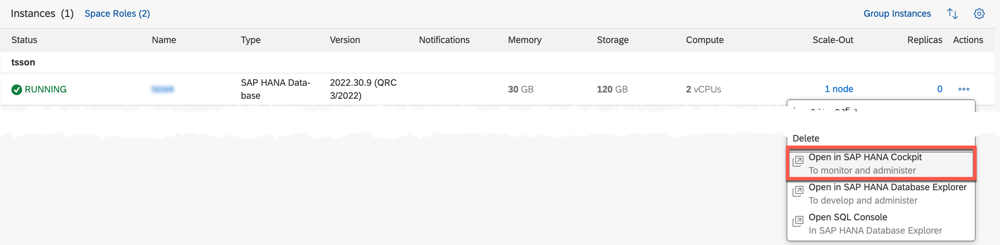
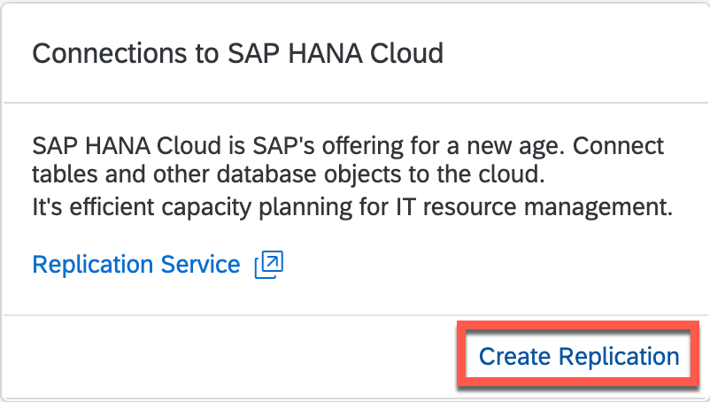
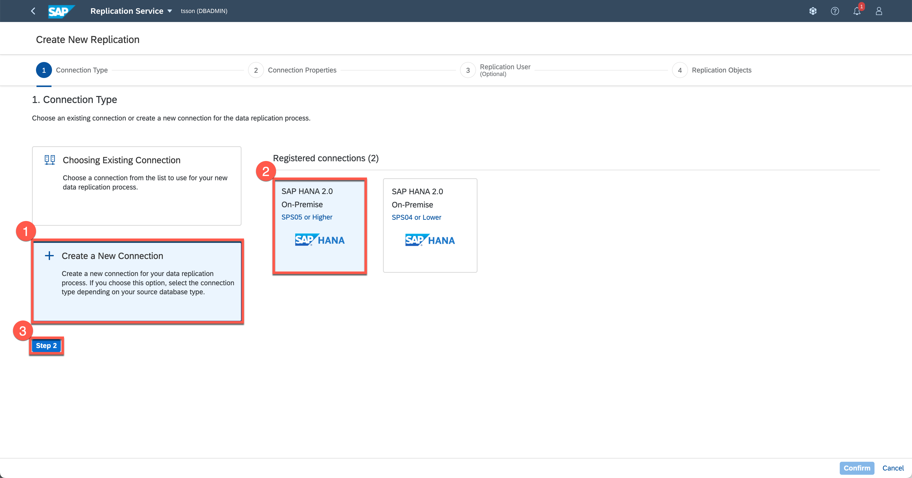
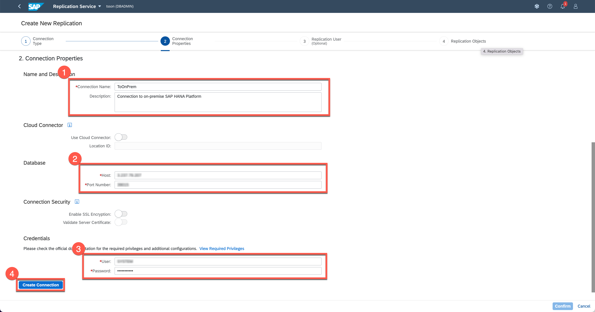
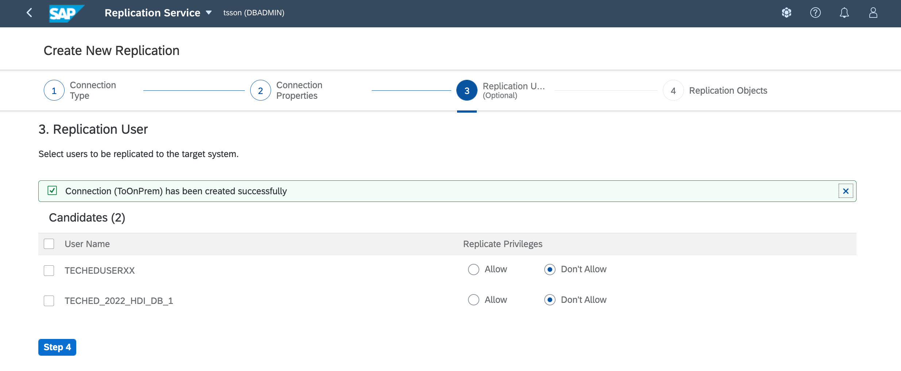
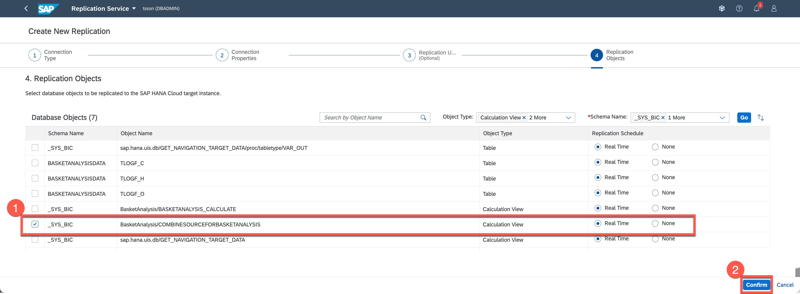
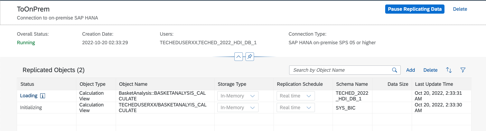

# Exercise 4 - Setup calculation view replication from SAP HANA Platform to SAP HANA Cloud

In this exercise, we will replicate the calculation view that was modeled or imported in the previous examples and setup the connection from SAP HANA Cloud to replicate the calculation views
- The first exercise was modeling using SAP HANA Studio and the models are saved in repository and the calculation view is created in schema.
- The second exercise was importing a model that was migrated from the repository based and converted for WebIDE as HDI containers.

## Prerequisites

- A running SAP HANA Cloud, database instance
  - Allow all IP to access - for replication, the remote table replication requires bi-directional connection between SAP HANA Cloud, HANA database and SAP HANA Platform.

    

  

(Optional)Setup cloud connector for configuration after the live event

  

  - In a corporate environment, the on-premise systems are protected behind  firewalls. To allow connection from SAP HANA Cloud to on-premise SAP HANA Platform, a cloud connector setup is required. For the simplicity of this workshop, this step will not be required as we have the SAP HANA Platform running in the public network so that a connection can be established directly from the SAP HANA Cloud instance.

  Please follow the following tutorial to install and configure the cloud Connector
  [Use the Cloud Connector to Connect SAP HANA On-Premise to SAP HANA Cloud, SAP HANA Database](https://developers.sap.com/tutorials/hana-cloud-mission-extend-08.html)
  

 

For connecting to the SAP HANA Platform, a technical user TECHEDCONNXX will be used with the correct privileges. The following privileges are required for the user

>- CATALOG READ for the wizard ui to list the objects to be selected for replication.
>- SELECT, DROP, and CREATE ANY on the schemas of users to be replicated for replicating users other than the technical user.
>- SELECT, DROP, and CREATE ANY on schemas with objects to be replicated objects to be replication assuming different from the user above.
>- SELECT on any other objects to be replicated, and TRIGGER if these objects need to be replicated in real-time. Trigger is needed as it is the means of real-time replication.

## Setup connection from SAP HANA Cloud to SAP HANA Platform

- From the SAP Cloud Central, start the SAP HANA Cloud, SAP HANA Database if it is not already running.

- Once the SAP HANA database is running, right click on the actions and select "Open in SAP HANA Cockpit" menu

    

  

- Login as DBADMIN
- In the Monitoring views, locate the "Connections to SAP HANA Cloud" card and select "Create Replication" to start the Replication Service wizard for replicating the calculation views

    

  

- "Create New Replication" wizard starts and the first step is to select the connection type of the source system. First, we will choose "Create a New Connection" which is already selected and select "SAP HANA 2.0 On-Premise" as the source system will will connect during the live workshop is SAP HANA 2.0 SPS06. This will use the remote table replication which is HANA native replication between HANA systems. For SPS04 or lower, as remote table replication is not supported, SDI will be used for replicating.
Once the selection is done, click "Step 2" to move to the second step

    

  

- Next, setup the connection properties to the on-premise SAP HANA Platform.
  - Enter name for the connection. The connection will be created as a remote source within the database
  - (Optional) Enable "Use Cloud Connector" for users following this exercise after the event and configured a cloud connector
  - Enter remote connection information to the SAP HANA Platform database
    - (Optional) When using the cloud connector, a virtual host and virtual port is mapped to the on-premise system. Use the virtual host and virtual port information here
  - Next enter the technical user to connect to the on-premise HANA database
  - Click "Create Connection" button once the property information have been entered to create the remote source in the background. Once the remote source is created, the wizard will show the status and move to the next step

    

  

- Next step is to select the schema owner where the table data exists.
  - Normally, the table where the schema resides are default schema where the name of the owner and the schema name is identical. But there are cases where the owner could be different as the owner may have used 'CREATE SCHEMA <schema_name>' where the <schema_name> is not a DB user. So, in this step, select the right owner. If the owner is not listed, it means that the technical user doesn't have the privilege on the schema to be replicated.
  - There may be 2 different users shown, one is for the table data and a second user is the for the HDI container. Using the Replication Service, the HDI Container based artifacts will be created as schema based on SAP HANA Cloud as only the runtime objects are being replicated.

    

  

- Now, we will select the calculation view that we would like to use in the SAP HANA Cloud. We will select the top level calculation view and the Replication Service will parse the metadata from the source system and build the dependent objects tree. Then it will re-create the runtime objects in SAP HANA Cloud from leaf up considering the dependency until the selected calculation view is created.
  - For repository based calculation view, select "BasketAnalysis/COMBINESOURCEFORBASKETANALYSIS" object which is the top level calculation view
  - Click "Confirm" button to start getting the metadata of the selected object and start building up the dependency tree.

    

  

- As the Replication Service reads the remote metadata, the selected object will be shown in the monitoring view and status will be in loading state with esclamation icon to display the status of the replication

    

  

  - Clicking on the esclamation icon will display a popup dialog showing the status of replication or load.

    

  

## Summary
You have now setup replication of calculation view from on-premise to SAP HANA Cloud, from both schema and hdi container based.

Continue to - [Exercise 5 - Extending replicated calculation view in BAS](/exercises/Exercise_5_SAP_BAS)
