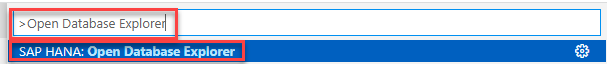
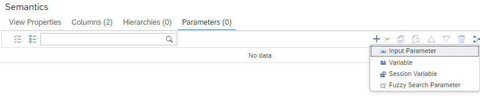

# Exercise 5 - Extending replicated calculation view in BAS

## Prerequisites

- a connection in Database Explorer to a running SAP HANA Cloud instance to which the calculation views have been replicated. This connection should use database user DBADMIN
- a user in BAS who is allowed to deploy to a cloud foundry space in which the HANA Cloud instance is running

## Steps in BAS to build calculation views on top of the replicated views

We will now create a calculation view on top of the replicated calculation view "BASKETANALYIS_CALCULATE". To do so we first need to ensure that we are authorized to use "BASKETANALYIS_CALCULATE" in our HDI container.

### Grant authorizations to use calculation view "BASKETANALYIS_CALCULATE" in calculation views

Again we will take a short-cut and grant the privileges to all database projects in BAS. Typically, a more fine granular authorization is used. See e.g., [FAQs](https://blogs.sap.com/2019/11/13/faq-modeling-in-web-ide/).


- Open Database Explorer:

  - Choose "Find Command" of menu "View"

    

  - an entry field pops up, enter "Database Explorer" and choose "SAP HANA: Open Database Explorer"

    

- in Database Explorer: Right-click on your DBADMIN database connection and choose "Open SQL Console":
  
  

- paste the following SQL statements into the console:

  ```SQL
  GRANT SELECT ON SCHEMA TECHED_2022_HDI_DB_1 TO "_SYS_DI#BROKER_CG"."_SYS_DI_OO_DEFAULTS" WITH GRANT OPTION;
  GRANT SELECT ON SCHEMA TECHED_2022_HDI_DB_1 TO "BROKER_USER"."RT_DEFAULTS";
  ```

- Select the statements with the mouse and press icon "Run" on the top left:

  

All Business Application Studio projects can now make use of the replicated views.

### Create a project in Business Application Studio

We will work in a project that we create from a template:

- Switch back to your Business Application Studio tab

- In the Welcome view, select "Start from template" (if the Welcome screen is not visible: open it by using menu "Help" and then select "Welcome"):

  

  - Choose SAP HANA Database Project and press "Start":

    

  - Enter "Extension" as Project Name and choose "Next"

  - Do not change the basic properties and choose "Next"

  - In step "Set Database Information" keep the default setting and press "Next"

  - Enter your Cloud Foundry email-address and password in the respective fields

  - Select your Org and Space and press "Finish". 
  
  The creation will take a couple of minutes to finish. When the project is ready, the screen will be reloaded and you see a tree-structure on the left.


### Create synonyms
If you want to refer to an objects outside of your project you need to define synonyms for these objects. We will create synonyms for our replicated calculation views next:

- In your Workspace: Navigate to folder "src", right-click on "src" and choose "New File"

  

  - name the file "replicatedObjects.hdbsynonym" and press "OK"

  Based on the extension a synonym definition file will be created and opened. If it does not open automatically, click on the respective file.

- Click on icon "Mass Import of Synonyms":

  

  - Select the Target Container Service, then the schema "TECHED_2022_HDI_DB_1" and press "OK"

    

    The synonyms for the two replicated calculation views will be defined

- Deploy the synonyms by pressing the rocket icon on the top right:

  

### Create calculation view "basketAnalysisEndUser"

- In your workspace: Navigate to folder "src", right-click on "src" and choose "New File"

  

  - Name the file "basketAnalysisEndUser.hdbcalculationview" and press "OK"

  - In the next dialog, keep the default settings and choose "Create"

- Add a Rank node to the modeling area by clicking on the icon on the left and afterwards at a free space:

    

- Add a data source to the Rank node:

  - Click on the rank node so that the "Add Data Source" icon (the plus sign) appears

  - Click on the "Add Data Source" icon

  - In the dialog, enter "**" to search for all objects that are visible to the current project

  - Select view "BASKETANALYSIS_CALCULATE" and press "Finish":

      

    The replicated view is now used as a datasource in your current calculation view.

- Add columns "countFrequency" and "ProductName" to the output of the rank node:

  - Double click on the rank node so that the Details appear

  - Select tab "Mapping"

  - Select "countFrequency" and "ProductName" by clicking subsequently on both while holding down key CTRL

  - Click on icon "Add To Output":

   

   The two columns are now listed on the right side and appear in the output of the node

- Define the ranking properties:

    - Switch to tab "Definition"

    - Enter as Target Value "50"

    - select column "countFrequency" for sorting and "Descending" as "Sort Direction":

       

- Connect the rank node to node "Aggregation" by dragging the connector arrow to node "Aggregation" and releasing the mouse button there:

    

- To map the columns of node Aggregation to the output:

    - double-click on node "Aggregation" to open the Details
    - select tab "Mapping"
    - in tab "Mapping" double-click on the name of the rank node to map all columns to the ouput:

      

- To add an input parameter:

    - double click on node "Semantics" and choose tab "Parameters"
    - in the drop-down of the plus icon, select "Input Parameter":

       

    - click on the input parameter and enter the values as shown in the screenshot. 
      In particular:
        - Name: filterProduct
        - Label: filter for the product in question   
        - Parameter Type: Column
        - View/Table Value Help: *search for "COMBINESOURCESFORBASKETANALYSIS", select the view and press "Finish"*
        - Reference Column: *select "ProductName"*
        - Default Value: Dark Blue Jeans

     


- click "Back" to close the Details view of the input parameter:

  

- click on the "Manage Parameter Mapping" icon:

  

  - Connect the input parameter "selectedProduct" of the source calculation view to the input parameter "filterProduct" of the current view:
  
    - Click with the left mouse button on the input parameter on the left and hold the mouse button down
    - Move the mouse to the input parameter on the right and release the mouse button

    A connecting line appears between the two input parameters:

    

### Deploy the calculation view

- deploy the calculation view with the rocket icon on the top right:

  


### Run a data preview

- Right-click on node Aggregation and choose "Data Preview"

  

  - The default value "Dark Blue Jeans" is already filled in for the input parameter "filterProduct". If you want to change the product you can use the value help next to "Dark Blue Jeans"

  - Execute the query by using button "Open Content":

    

- To display the products that were sold together with the selected product (if you keep the default: with "Dark Blue Jeans") select option "Raw Data":

  

- If you want to sort the values by "countFrequency":

  - In tab "Columns" of the Details of node "Semantics", select icon "Sort Result Set"
    
    - click on the plus-sign to add a sort criterion

    - choose "countFrequency" as the sort criterion and "Descending" as the Sort Direction

    - Finish with OK:

  

  - Redeploy the view by clicking at the rocket icon or using the keyboard-shortcut of holding down key "CTRL" and pressing key "d"

  - Start a new data preview to check that the values are now sorted by "countFrequency"

## Summary
You have are extending the calculation view that was replicated from the on-premise in SAP HANA Cloud

Continue to - [Exercise 6 - Modification calculation view on-premise and apply to SAP HANA Cloud](/exercises/Exercise_6_Modify_And_Appy)
