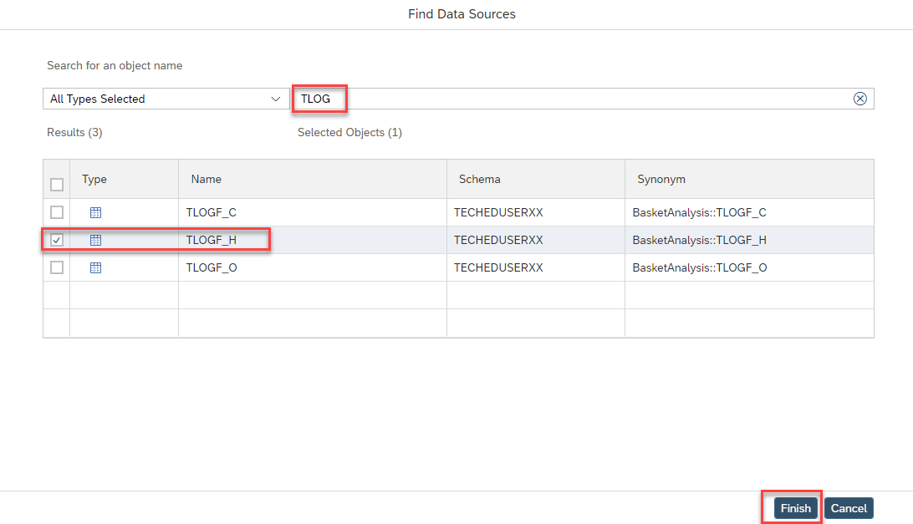

# Exercise 6 - Modification calculation view on-premise and apply to SAP HANA Cloud

We will modify calculation view "COMBINESOURCESFORBASKETANALYSIS" in SAP Web IDE to illustrate the replication behavior after a change to the source.

Prior to applying the changes to SAP HANA Cloud, we go to the SAP HANA Cockpit in BTP and locate the "Connections to SAP HANA Cloud" application card under Monitoring section. You will notice that the name of the connection that was entered in Exercise 4 is listed with some number on the right. The number is the number of objects being replicated.
    

- We click on the connection name, and move to the monitoring of the replication.
    

- In the monitoring screen, on the top right, there is a button to pause the replication which is pause the realtime data replication. With this feature, maintenance can be done on the source system.
    

## Modify calculation view "COMBINESOURCESFORBASKETANALYSIS"

- Open calculation view "COMBINESOURCESFORBASKETANALYSIS" in SAP Web IDE by double-clicking on the respective file on the left. If the file is not visible, open the db/src tree first:

    

- Click on node "Union_1" so that the additional icons appear and select the plus sign to add a datasource:

    

- In the Add Data Source dialog, search for "TLOG", select "TLOGF_H" and press "Finish":

    

"TLOGF_H" is now added to your union node

- Double-click on the union node so that the Details are shown and select tab "Mapping"

- Click button "Auto Map by Name":

    

The columns of TLOGF_H are now mapped to the output columns based on name correspondence

- save the calculation view by pressing the icon on the top left:

    

- Right-click on calculation view file COMBINESOURCESFORBASKETANALYSIS and select "Build" and then "Build Selected Files"

    

- The modified database object has been created.

- After maintenance, or modifications on the source system, click resume button and the system will pickup any changes done on the calculation view since the last activations.
    

## Summary
You have now modified the calculation view model in the on-premise instance and the changes are applied to the SAP HANA Cloud instance
