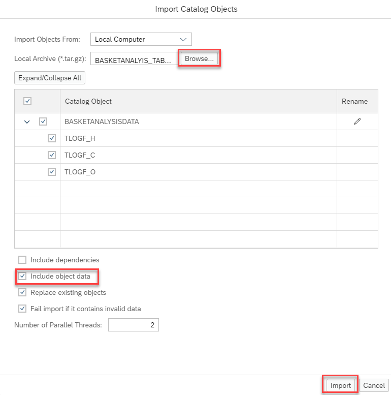
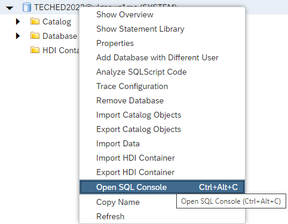
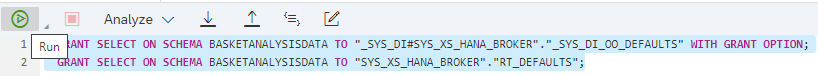

# Import tables in SAP Database Explorer

<mark> You only need to follow these steps if you don't have a running SAP HANA Studio </mark>


- Open SAP HANA Database Explorer. The detail connection info will be given during TechEd Live Virtual Workshop

- As the database instance is not registered, you would need to register the connection info in the "Add Instance" dialog window

- Select "SAP HANA Database (Multitenant)" for the instance type

- Enter host info
  - For users attending the live virtual workshop, the connection info will be provided during the workshop. 
    - Use a database connection with the database user assigned during the workshop
  - For users attending after the workshop, please connect to the local HANA instance
    - Use the system user to connect


- Expand the connection and righ-click on "Catalog"

  - Choose "Import Catalog Objects":

    


- Use the "Browse" button to select your local version of BASKETANALYIS_TABLES_DatabaseExplorer" (you can download it from the "resources" section)

    - Select "Include object data". You can ignore the other options

    - Start the import process by pressing "Import":

    

- Open a SQL console by right-clicking on your connection and selecting "Open SQL Console":

    

- Type or copy and paste the following statements:

    ```SQL
  GRANT SELECT ON SCHEMA BASKETANALYSISDATA TO "_SYS_DI#SYS_XS_HANA_BROKER"."_SYS_DI_OO_DEFAULTS" WITH GRANT OPTION;
  GRANT SELECT ON SCHEMA BASKETANALYSISDATA TO "SYS_XS_HANA_BROKER"."RT_DEFAULTS";
  ```

- Mark all statements with your mouse and execute the highlighted statements by pressing the "Run" button on the top-left:

  

  These two statements allow using the tables in every Web IDE project.

     > Typically, not all projects should have the authorization to use certain tables and a more fine-granular authorization setup is used. How this can be achieved with HDI development can be found e.g., in this [blog](https://blogs.sap.com/2018/12/11/how-to-use-objects-contained-in-a-schema-outside-of-your-web-ide-full-stack-project-in-sap-hana-service/).

The required tables have been imported and the authorizations assigned. In the next steps we will create calculation view models.
