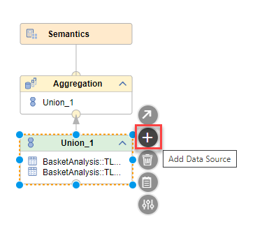
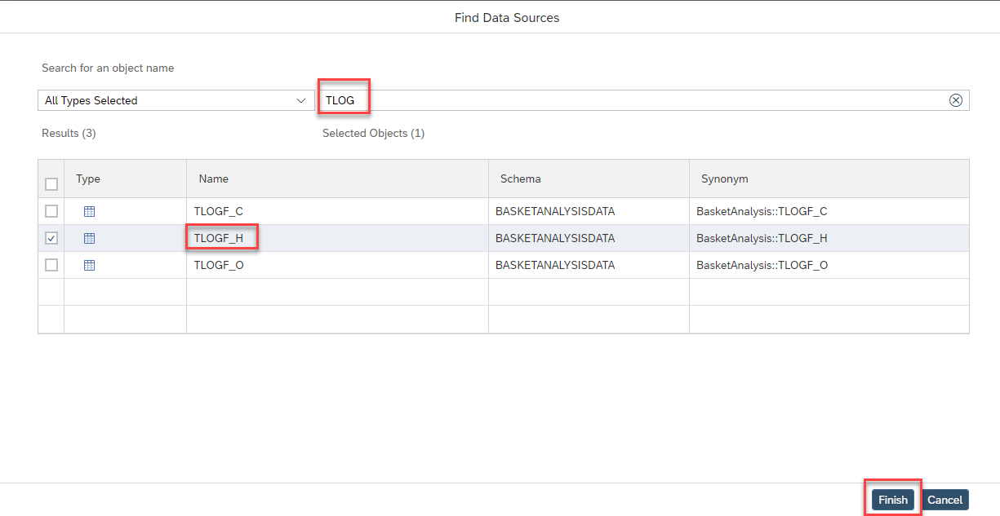

# Modification steps in SAP WebIDE

We will modify calculation view "COMBINESOURCESFORBASKETANALYSIS" to illustrate the replication behavior after a change to the source.

## Modify calculation view "COMBINESOURCESFORBASKETANALYSIS"

- Open calculation view "COMBINESOURCESFORBASKETANALYSIS" by double-clicking on the respective file on the left. If the file is not visible, open the db/src tree first:

    

- Click on node "Union_1" so that the additional icons appear and select the plus sign to add a datasource:

    

- In the Add Data Source dialog, search for "TLOG", select "TLOGF_H" and press "Finish":

    

"TLOGF_H" is now added to your union node

- Double-click on the union node so that the Details are shown and select tab "Mapping"

- Click button "Auto Map by Name":

    

The columns of TLOGF_H are now mapped to the output columns based on name correspondence

- save the calculation view by pressing the icon on the top left:

    

- Right-click on calculation view file COMBINESOURCESFORBASKETANALYSIS and select "Build" and then "Build Selected Files"

    

The modified database object has been created. 

We will have a look at the impact of this modification on the replication next.